# VibesFlow

**Version:** 0.1.0

A React Native mobile application that transforms physical movement into personalized, unique rave-like music sets using AI and decentralized tech.


# VibesFlow

VibesFlow is a real-time music generation platform that combines sensor input, AI music generation, and decentralized storage. Users create "vibestreams" (a dynamic NFT with delegation) by moving their device or interacting with the interface, which generates live music through Lyria RealTime API. These sessions are automatically chunked, compressed, and stored on Filecoin via the Synapse SDK, then made available through FilCDN for fast retrieval and sharing.

## Key Features

- **Motion-based Music Creation**: Transform your movement into unique rave-like music sets
- **Blockchain Integration**: Enforce ownership on Near, and store set-chunks on Filecoin for provenance
- **AI-Powered Analysis**: Advanced mood sensing and processing algorithms, interpreted by on-chain agents
- **Cross-Platform**: Built with React Native for iOS, Android, and Web

## Technologies
- NEAR for RTA dynamic NFTs with delegation
- Filecoin through SynapseSDK for decentralized storage and provenance of each RTA's chunks
- FilCDN to retrieve organized proof sets and power the Vibestreaming Market
- Lyria (GoogleGenAI) for real-time, continuous, adaptive music generation
- JavaScript/TypeScript, React Native, Expo
- Node, Express, EC2, DynamoDB, Lambda

## Architecture Overview

```mermaid
graph TB
    User[👤 User Input] --> Sensors[📱 Sensor Data]
    Sensors --> Interpreter[🎵 Interpreter]
    Interpreter --> Orchestrator[🎛️ Orchestrator]
    Orchestrator --> Lyria[🤖 Lyria RealTime API]
    Lyria --> Audio[🎶 Generated Audio]
    
    Audio --> Chunks[📦 Audio Chunks Service]
    Chunks --> Synapse[🗄️ Synapse SDK]
    Synapse --> Filecoin[🌐 Filecoin PDP]
    
    RTA (Custom Proof Set) --> FilCDN[⚡ FilCDN]
    FilCDN --> Market[🏪 Vibe Market]
    
    NEAR[🔗 NEAR Protocol] --> RTA[🎨 Real-Time Asset]
    
    subgraph "Frontend (React Native)"
        Sensors
        Interpreter
        Orchestrator
        Market
    end
    
    subgraph "Backend Services"
        Chunking
        Compression
    end
    
    subgraph "Decentralized Storage"
        Synapse
        Filecoin
        FilCDN
    end
```

## Component Interactions

The application follows a real-time, close-to-zero latency pipeline where user sensor inputs generate music that's simultaneously played and preserved:

1. **Input Layer**: Sensor data (accelerometer, touch) is interpreted into musical parameters
2. **Generation Layer**: Lyria RealTime API generates audio based on these parameters
3. **Storage Layer**: Audio is chunked, compressed, and stored on Filecoin through SynapseSDK, with metadata on NEAR
4. **Distribution Layer**: FilCDN powers a Soundcloud-grade streaming marketplace by providing fast access to stored vibestream-sets.

## NEAR Protocol Integration

### RTA v2 Contract (`near/contracts/rtav2/`)

Our NEAR smart contract implements **NEP-171** (Non-Fungible Token) and **NEP-366** (Delegation) standards to create unique NFTs for each vibestream session.

Enables:
- Minting unique tokens for each vibestream
- Editable metadata (till session ends) through delegation
- Metadata association linking to Filecoin storage

Next steps:
- Restoring Shade Agents (Chunker, Dispatcher) for:
    - improved backend performance and reducing overhead 
    - on-chain raffling (VRF) of chunk owners
    - using "swarms" (of workers) to replace EC2 to speed-up parallel uploading and more reliable metadata structuring and compilation

- Deploying and integrating contracts:
    - ppm.vibesflow.testnet: a "global" contract for pay-per-minute access to vibestreams.
    - subscription.vibesflow.testnet: 5 NEAR / month for limitless access to the Vibe Market (playback streaming platform of completed RTAs)
    - royalties.vibesflow.testnet: royalty distribution based on amount of monthly plays for the individual chunk (not the entire vibestream)


## Synapse SDK Integration

### Backend Storage (`backend/rawchunks/synapseSDK.js`)

We integrate the Synapse SDK to store vibestream data on Filecoin using Proof of Data Possession (PDP). Each Real-Time Audio session gets a unique RTA_ID and corresponding proof set.

**Our Implementation**:
- Creates dedicated proof sets per RTA_ID for organized storage
- Handles USDFC payments and Pandora service approvals automatically
- Compresses 60-second audio chunks using WebM/Opus encoding
- Stores temporary metadata in DynamoDB for "hot" retrieval

**vs Standard Synapse Usage**:
- Standard: Single proof set for all user data
- VibesFlow: One proof set per vibestream for granular access control
- Standard: Manual payment management
- VibesFlow: Automated payment setup with intelligent batching

```mermaid
graph LR
    RTA[🎵 RTA Session] --> Chunker[📦 60s Chunks]
    Chunker --> Compress[🗜️ WebM Compression]
    Compress --> Synapse[📡 Synapse SDK]
    
    subgraph "Filecoin Storage"
        Synapse --> ProofSet[🛡️ Proof Set]
        ProofSet --> Storage[💾 PDP Storage]
    end
    
    Synapse --> DynamoDB[🗃️ Metadata DB]
    Storage --> FilCDN[⚡ FilCDN Ready]
```



## FilCDN & Vibe Market

### Context Provider (`app/context/filcdn.tsx`)

Our FilCDN integration bridges frontend and backend, using Proof Sets to retrieve Vibestreams' structure and chunk CIDs through the Synapse SDK integration. FilCDN powers the Vibe Market, VibesFlow's streaming platform where users can playback stored Vibestreams chunk-by-chunk, without interruption.

### Vibe Market (`app/components/VibeMarket.tsx`)

A marketplace interface for discovering and playing stored vibestreams. Each entry displays:
- Creator information and participant count
- RTA (total) duration and chunk count
- Proof set status and storage provider details
- Real-time playback capabilities

**Our FilCDN Integration**:
- Custom RTA_ID structure: `{creator}_{timestamp}_{session}`
- Proof set metadata includes participant tracking and session duration
- FilCDN URLs with the pattern: `https://{wallet}.calibration.filcdn.io/{cid}`

**vs Standard FilCDN Usage**:
- Standard: Generic file storage and retrieval
- VibesFlow: Structured vibestream metadata with social features
- Standard: Single file uploads
- VibesFlow: Multi-chunk sessions with sequential playback

```mermaid
graph TB
    Market[🏪 Vibe Market] --> Context[🔗 FilCDN Context]
    Context --> Backend[🖥️ Backend API]
    Backend --> Synapse[📡 Synapse SDK]
    
    subgraph "Vibestream Data"
        Synapse --> ProofSets[🛡️ Proof Sets]
        ProofSets --> Chunks[📦 Audio Chunks]
        ProofSets --> Meta[📋 RTA Metadata]
    end
    
    subgraph "User Experience"
        Chunks --> Player[▶️ RTA Player]
        Meta --> Display[📱 Stream Info]
        Market --> Discovery[🔍 Browse Streams]
    end
```



## Lyria RealTime & Orchestration

### Sensor Interpretation (`app/orchestration/interpreter.js`)

Converts raw sensor data into Lyria-compatible musical parameters with ultra-sensitive response and maximum variety. The interpreter:
- Maps accelerometer data to genre selection across 8 psychedelic rave genres
- Applies real-time smoothing with processing state awareness
- Generates dynamic style prompts with cross-genre contamination for unpredictability

### Orchestration Management (`app/orchestration/orchestrator.js`)

Manages two-way communication with Lyria RealTime API with smart load balancing:
- Adaptive batching that responds to audio chunk processing states
- Enhanced smoothing system with processing state awareness
- Smart transition handling to minimize interruption during audio generation

### Audio Chunk Processing (`app/components/chunks.tsx`)

Handles real-time audio compression and background upload to minimize interference with live music generation:
- WebM/Opus compression reducing 15MB raw PCM to 1-2MB
- Intelligent load balancing with music activity detection
- Background processing queue with priority-based chunk handling

